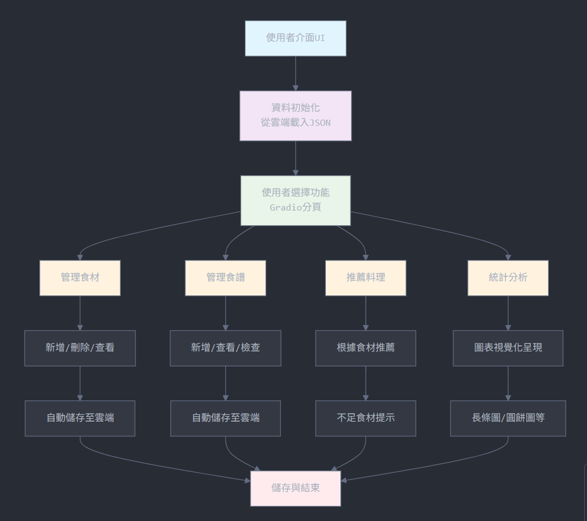
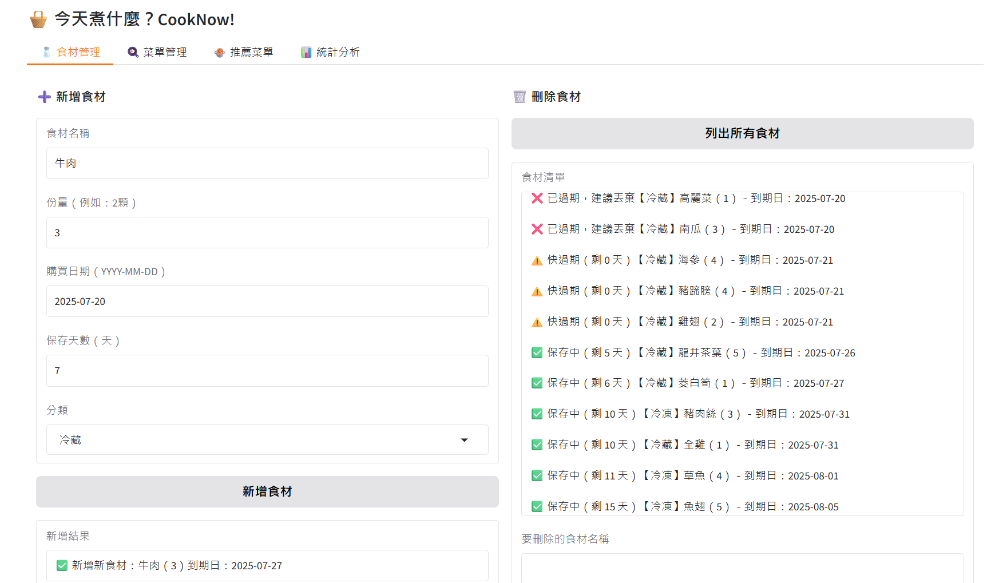
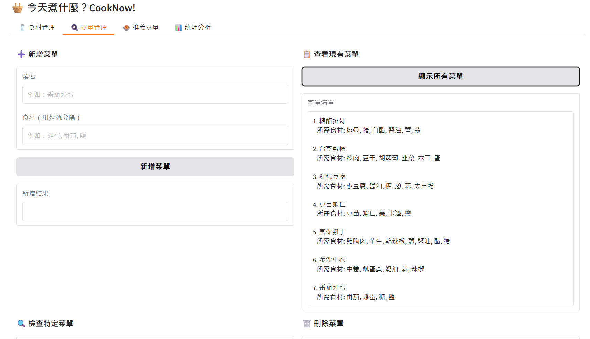
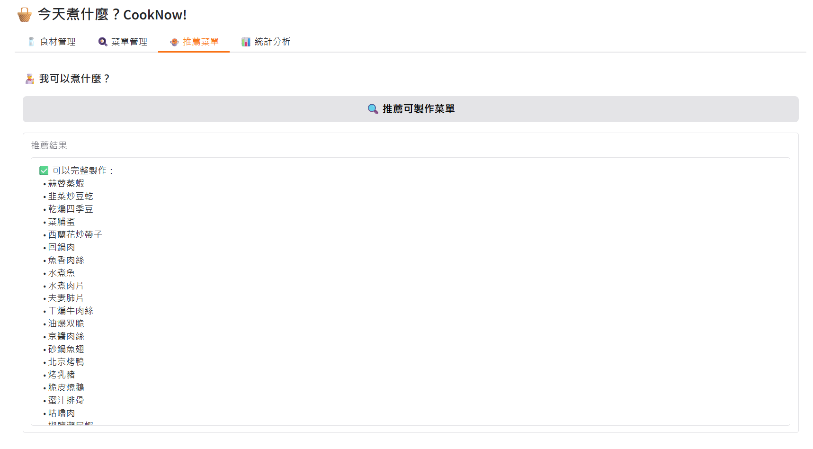
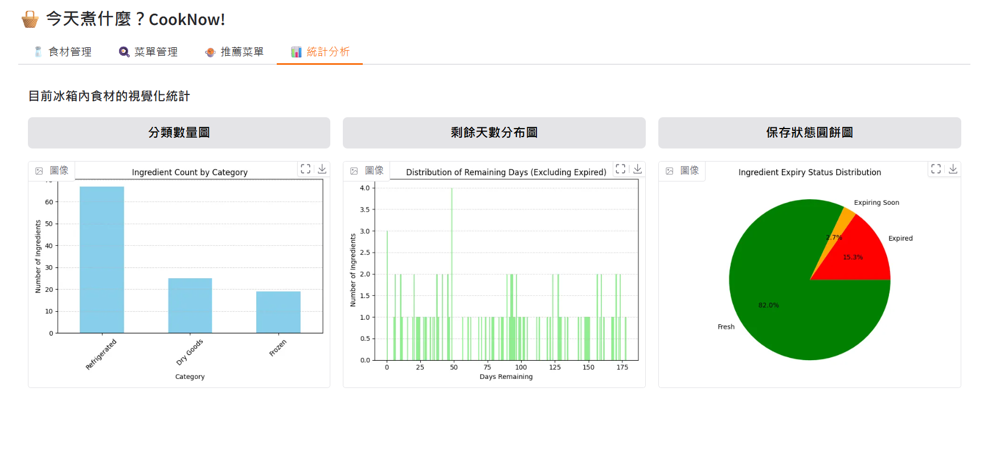
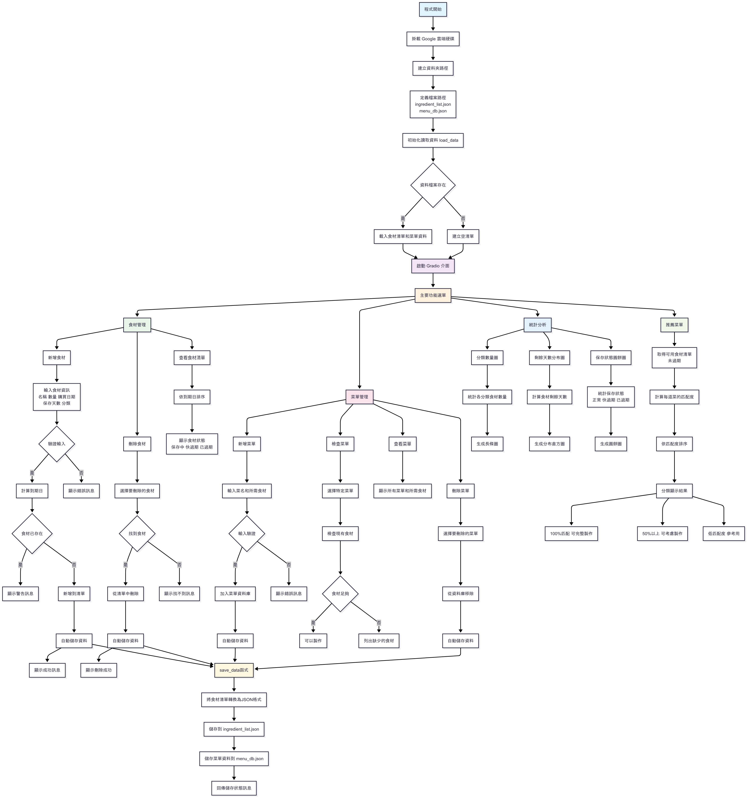

# 113-3-DSCP 
## 🍳 Motivation
- Our family often forgets to eat the food we buy, and it ends up expiring in the fridge. I’ve always wanted to create a small tool to help manage ingredients more efficiently. Over time, I expanded this idea into something more—such as adding recipe records and even suggesting what to cook based on what’s available.
## 🛠 Features
- This program contains four main modules, built with Gradio as the user interface and using Google Drive to store ingredient and recipe data in JSON format.
### 1️⃣ Ingredient Management
- Add ingredients (name, quantity, purchase date, and shelf life)

- Delete ingredients (optionally remove a partial quantity)

- View all current ingredients with expiration status (fresh / expiring / expired)

### 2️⃣ Recipe Management
- Add new recipes (name and required ingredients)

- Delete recipes

- View all saved recipes

- Check if current ingredients are sufficient to make a selected recipe

### 3️⃣ Recipe Recommendation
- Match current ingredients with recipes to suggest what you can cook

- Only recipes with all required ingredients are listed

(Future idea: integrate Groq API + RAG for “near match” suggestions that skip a few minor ingredients like spices)

### 4️⃣ Ingredient Statistics (Visualization)
- Bar chart showing the number of ingredients by storage type (Refrigerated / Frozen / Dry Goods)

- Histogram showing distribution of remaining days (excluding expired items)

- Pie chart showing preservation status (expired / expiring soon / fresh)

## demonstration  
youtube link
[Demonstration Video](https://youtu.be/3NouwoXCoDE)
[Presention video](https://youtu.be/Mq7CRGaWaIg)

## 🗂 Data Info
- All data is saved to Google Drive automatically every time you add or delete an item.

- On program launch, it loads ingredient_list.json and menu_db.json from your Drive.

- Note about Google Colab & Google Drive Access
    - Each time you launch the program in Google Colab, it will ask for permission to re-mount your Google Drive—even if you've granted access before.
    - Also, Colab links are temporary and will expire approximately 3 days after the session ends. This means the shared Colab URL or file access won’t remain valid indefinitely.
## ✅ Test datasets (generated by ChatGPT):
📦 Ingredient JSON:https://drive.google.com/file/d/1D4UD7DYS1HP8ikAfb-m5qvzct9E_o-1Q/view?usp=sharing

📘 Recipe JSON:https://drive.google.com/file/d/1aN-pHJbeKcZXSwACaqTKyRHw4DWSb3BZ/view?usp=sharing

